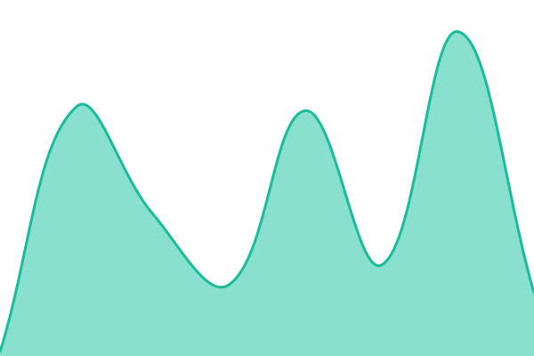

# [📈 Live Status](https://hamcool.github.io/upptime): <!--live status--> **🟧 Partial outage**

This repository contains the open-source uptime monitor and status page for [hamcool](https://hamcool.github.io/upptime), powered by [Upptime](https://github.com/upptime/upptime).

With [Upptime](https://upptime.js.org), you can get your own unlimited and free uptime monitor and status page, powered entirely by a GitHub repository. We use [Issues](https://github.com/hamcool/upptime/issues) as incident reports, [Actions](https://github.com/hamcool/upptime/actions) as uptime monitors, and [Pages](https://hamcool.github.io/upptime) for the status page.

<!--start: status pages-->
<!-- This summary is generated by Upptime (https://github.com/upptime/upptime) -->
<!-- Do not edit this manually, your changes will be overwritten -->
<!-- prettier-ignore -->
| URL | Status | History | Response Time | Uptime |
| --- | ------ | ------- | ------------- | ------ |
|  [Eclipse Aus](https://eclipsetravel.com.au/) | 🟥 Down | [eclipse-aus.yml](https://github.com/hamcool/upptime/commits/HEAD/history/eclipse-aus.yml) | 

 40ms
     
 | 

<a href="https://hamcool.github.io/upptime/history/eclipse-aus">0.00%</a>
    

|  [Eclipse NZ](https://eclipsetravel.co.nz/) | 🟩 Up | [eclipse-nz.yml](https://github.com/hamcool/upptime/commits/HEAD/history/eclipse-nz.yml) | 

 1007ms
     
 | 

<a href="https://hamcool.github.io/upptime/history/eclipse-nz">99.24%</a>
    

|  [Eclipse US](https://eclipsetravel.com/) | 🟩 Up | [eclipse-us.yml](https://github.com/hamcool/upptime/commits/HEAD/history/eclipse-us.yml) | 

 1042ms
     
 | 

<a href="https://hamcool.github.io/upptime/history/eclipse-us">99.24%</a>
    

|  [Eclipse Aus - Africa](https://eclipsetravel.com.au/africa) | 🟩 Up | [eclipse-aus-africa.yml](https://github.com/hamcool/upptime/commits/HEAD/history/eclipse-aus-africa.yml) | 

 1805ms
     
 | 

<a href="https://hamcool.github.io/upptime/history/eclipse-aus-africa">99.25%</a>
    

<!--end: status pages-->

[**Visit our status website →**](https://hamcool.github.io/upptime)

## 📄 License

- Powered by: [Upptime](https://github.com/upptime/upptime)
- Code: [MIT](./LICENSE) © [Anand Chowdhary](https://anandchowdhary.com)
- Data in the `./history` directory: [Open Database License](https://opendatacommons.org/licenses/odbl/1-0/)
